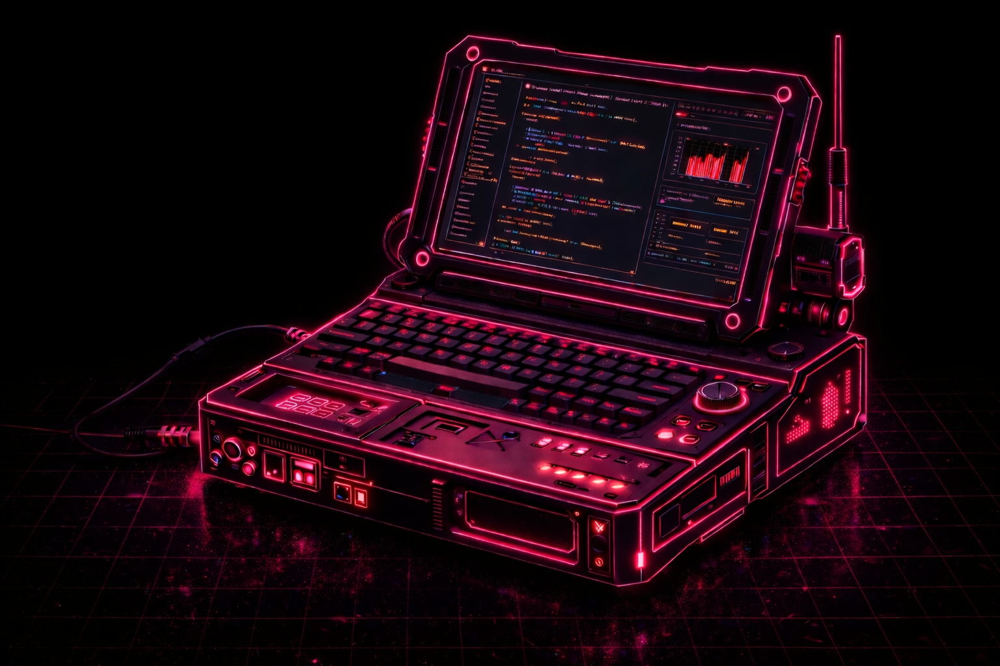
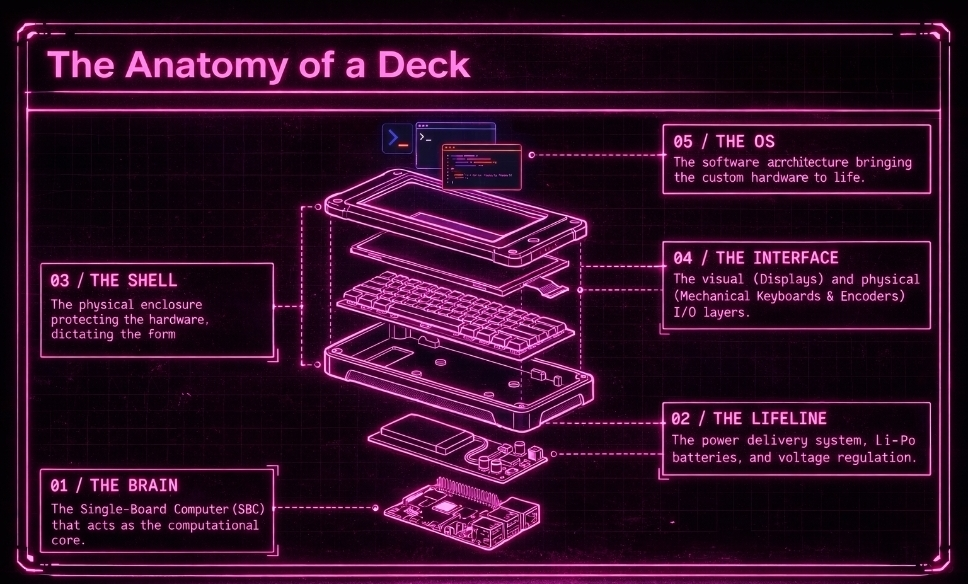
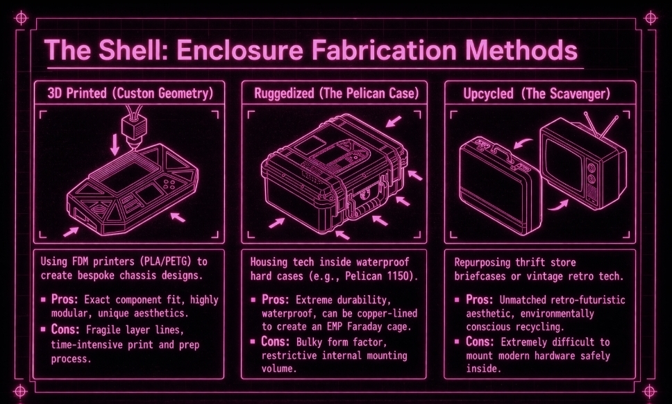
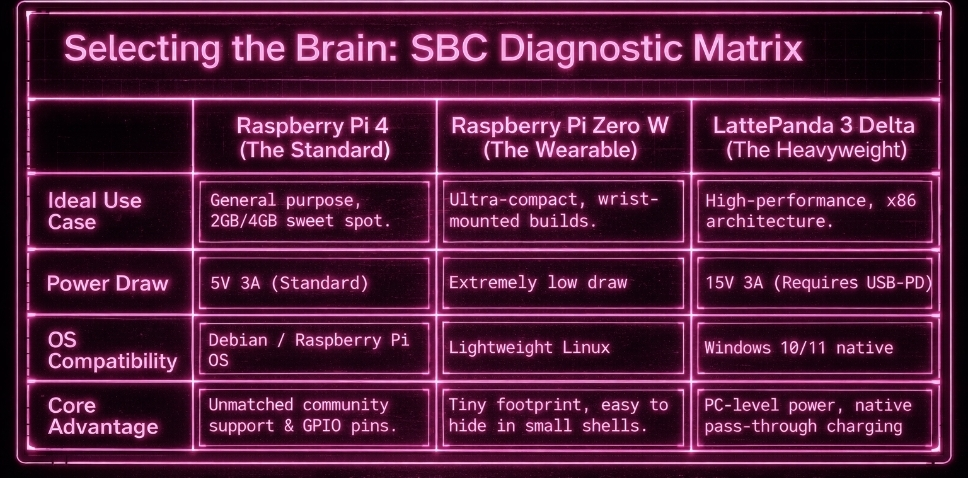

You don't need to know much about hardware to start. A **cyberdeck** can be as simple as a screen and a keyboard plugged into a small computer, or as complex as a fully custom portable machine.

 

 

There's no single way to build one. Different budgets, aesthetics, and use cases lead to very different setups. The only rule is to start with something that works, then iterate.

 

## WHAT IS YOUR CYBERDECK FOR

Before building anything, decide what you want it to do.

- write, take notes, journal
- SSH and code anywhere
- distraction-free machine
- small AI assistant or LLM pet
- a gaming console with an emulator
- your own e-ink reader
- media device: music, movies, reading
- portable travel setup

This choice matters more than the hardware. It defines everything that comes next.

 

## LEVELS

**Beginner**: off-the-shelf parts. Raspberry Pi or old laptop, small screen, keyboard, power bank. Everything is plugged together, maybe thrown into a box. Fast to build, no friction.

**Intermediate**: now you care about form. You integrate components, clean up cables, maybe add an internal battery or a custom case. It starts to feel like a real device.

**Advanced**: fully custom. Internal wiring, soldering, optimized layout, extra modules, switches, LEDs. Built for a specific use, not just assembled.

You don't need to "reach" a level. You just move forward naturally.

 
 
 

 

## WHAT YOU ACTUALLY NEED

Every cyberdeck comes down to the same core pieces:

<ul style="color:white">
  <li>compute: Raspberry Pi, mini PC, old laptop</li>
  <li>screen: HDMI display or reused panel</li>
  <li>keyboard</li>
  <li>power: battery or power bank</li>
  <li>connections: cables, adapters, hub</li>
</ul>

That's it.

You can build a first version for cheap, especially secondhand. Around **$100** is enough to get something working.

You can add so many accessories depending on what you want to do with it in the first place. It could be an **e-ink screen**, a **touchscreen**, a **solar panel**, speakers, and much more.

 

 

One of my favorite parts personally is choosing the **shell**. I've seen many cool projects built with **upcycled cases**. You can just go to a **thrift store**, a **secondhand shop**, or browse **eBay** and have fun.

 

## CHOOSE THE COMPUTE

I would recommend starting with a **raspberry pi 4**. It lets you do quite a lot of things already, and for a first build it's probably what I would recommend most.

After that, it really depends on what you want from the machine. I found this little chart, like some of the other images, on tiktok.

 

 

This one will need to be powered too. So you can go for an **external battery**, and you might even already have one at home. Just be careful about the **voltage**. Otherwise you can keep it plugged in with cables, but I think that's annoying if you actually want to move the cyberdeck around.

 

## USE AN LLM

IMO you can get through most of this with an **LLM in your pocket**.

You don't need to know everything in advance. You mostly need to know how to ask practical questions: what screen works with what board, how much power a setup draws, what cable or converter you need, how to mount parts, how to wire a switch, how to debug something that doesn't boot.

Hardware gets much less intimidating once you treat it as a sequence of small concrete problems instead of one giant technical wall.

 

## COME HANG OUT ON DISCORD

 

Come hang out on discord and share about your project.

<a href="https://discord.gg/j3Jsgdba" style="color:#ff69b4; font-size:1.4em; font-weight:700;">click here</a>

 

I'm doing a small **april cyberdeck challenge**, so come share yours or ask questions. People can help each other, swap ideas, and it could be fun.
